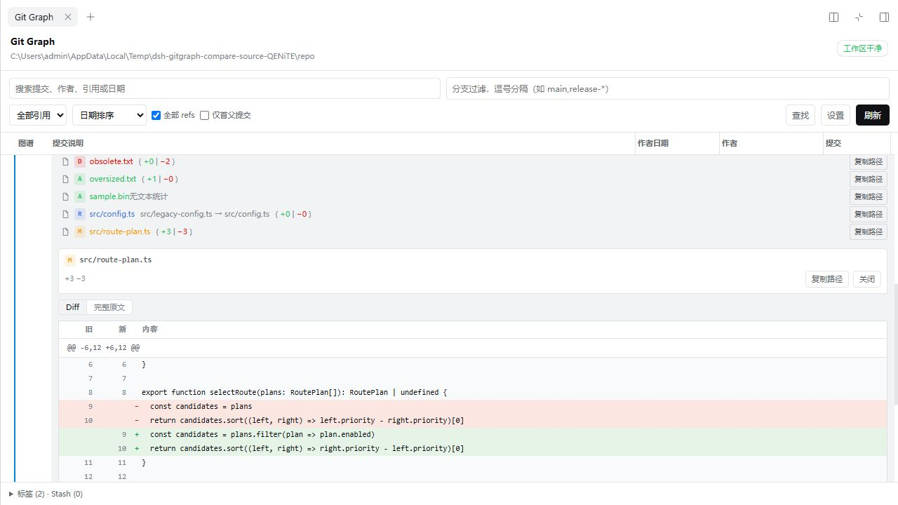
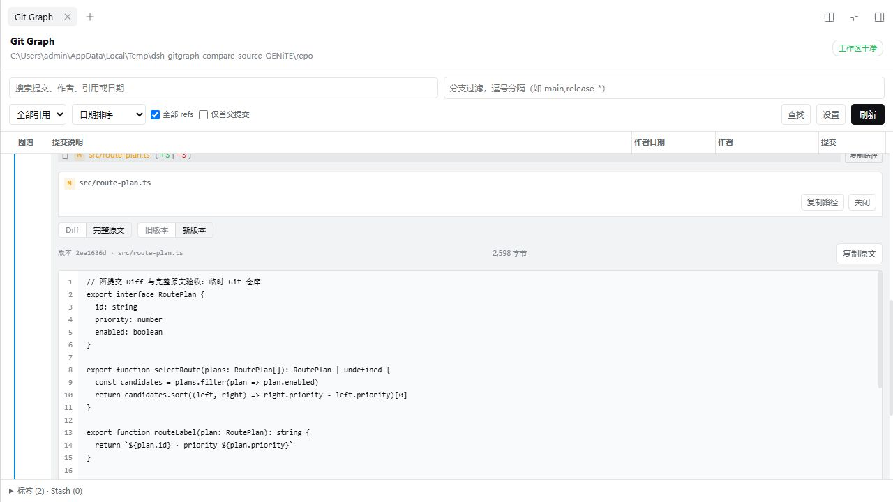
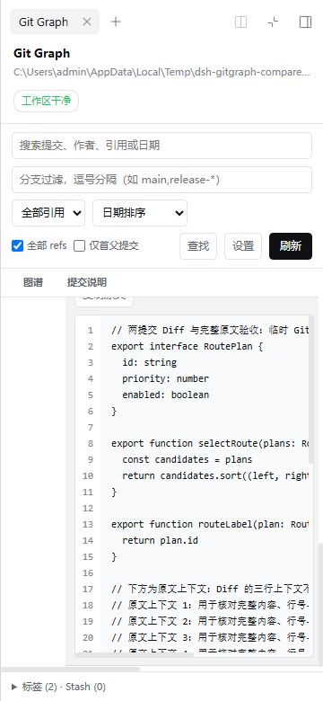

<p align="center">
  
</p>

<p align="center">
  <strong>Version 0.5.0</strong> · DSH 0.2.0-rc.2 · <a href="LICENSE">MIT</a><br>
  <a href="README.zh.md">中文说明</a> · <a href="docs/screenshots/readme-header.svg">Static title</a>
</p>

A read-only Git Graph for the native right sidebar of DeepSeek Harness Web. Browse your workspace's history, branches, and file changes without an API key or conversation message.

<p align="center">
  <a href="#install-or-update">Install</a> · <a href="#usage">Usage</a> · <a href="#keyboard-controls">Keyboard controls</a> · <a href="#scope">Scope</a> · <a href="#uninstall">Uninstall</a> · <a href="#documentation">Documentation</a>
</p>


<details>
<summary>More screenshots: commit comparison, full source, English, and narrow screens</summary>








</details>

## Features

- **History** — Commit topology, branches, tags, HEAD, search, and history filters.
- **Commit details** — Inline details with author/committer dates, parents, references, signature status, and copying.
- **References** — Three reference layouts and combined labels for matching local/remote branches at the same commit.
- **File changes** — File tree/list views, per-file diffs, and uncommitted changes; select two commits and open each changed file's diff.
- **Historical source** — Read and copy the complete text of an old or new file version, with its path, commit hash, line numbers, and size.
- **Messages & authors** — Commit messages with links, bold, italic, and inline code; real GitHub/Gravatar author avatars.
- **Display settings** — Resizable columns, date display options, compact rows, line styles, and colour presets, saved per repository.
- **Interface** — Chinese/English, light/dark themes, pane fullscreen, and narrow-screen support.

## Install or update

Requires DSH **0.2.0-rc.2**, the `dsh` CLI, and Git installed on the DSH Host.

Install `v0.5.0` from its GitHub tag:

```powershell
dsh plugin --profile web add https://github.com/WhitePlusMS/dsh-git-graph/archive/refs/tags/v0.5.0.tar.gz
dsh web
```

For updates, stop DSH Web, run `add` for the desired version, then restart it.

For a custom profile, local `.tgz` installation, or source builds, see the [development guide](docs/DEVELOPMENT.md#本地安装与自定义-profile).

## Usage

1. Select a workspace in DSH Web and open the right sidebar.
2. Select **Git Graph** from the sidebar's start page.
3. Select a commit for inline details, or a file for its diff. Select **Uncommitted Changes** to inspect working-tree changes.
4. Choose **Compare commit…** and a base commit, then select a changed file. In a historical file viewer, switch between **Diff** and **Full source**, and choose the old or new version.

Use **Settings** to adjust the display. Settings are saved separately for each repository.

Real avatars are enabled by default and access GitHub/Gravatar. GitHub queries use the commit author's email; Gravatar uses an email hash. You can disable them in Settings; missing images or failed requests retain initials.

## Uninstall

```powershell
dsh plugin --profile web remove dsh-git-graph
```

Use the profile you installed into, and restart it after removal.

## Keyboard controls

| Control | Action |
| --- | --- |
| `Ctrl/Cmd+F` | Find within loaded results |
| `Ctrl/Cmd+Shift+F` | Toggle display settings |
| `↑` / `↓` | Select a commit when Find is closed and cleared |
| `H` | Locate HEAD, or show an out-of-range hint |
| `Enter` / `Space` on a row or node | Select that commit |
| Drag a column divider / `←` / `→` | Resize a column; arrow keys work when the divider is focused |
| Double-click a divider | Restore its default width |

Shortcuts apply while focus is inside Git Graph. Normal navigation keys do not intercept typing in inputs or scrolling in a file viewer.

## Scope

- The graph reads the current workspace's local Git data. Refresh does not fetch remote changes or modify the repository.
- Initially loads 100 commits, with manual loading up to 500. Search scans up to 2,000 commits; Find searches loaded results. Reference-type filters show commits directly carrying the selected kind of label.
- Historical file viewers provide unified diffs and full text up to 1 MiB per file. Binary and oversized files show their status; text is not truncated and presented as complete. Renamed, added, and deleted files use the available version and corresponding path.
- Side-by-side diffs, syntax highlighting, tag signature verification, and stash diffs are not available. Tag/stash entries provide summaries and copying.

## Documentation

- [Development, local installation, and API details](docs/DEVELOPMENT.md)
- [Release notes](CHANGELOG.md) · [Commit comparison and full source report](docs/COMPARE_SOURCE_TEST_REPORT.md)
- [Display acceptance report](docs/DISPLAY_TEST_REPORT.md)
- [P0 report](docs/P0_TEST_REPORT.md) · [DSH adaptation report](docs/DSH_0.2_TEST_REPORT.md)

---

Inspired by [vscode-git-graph](https://github.com/mhutchie/vscode-git-graph). Thanks to its authors and contributors.

Licensed under [MIT](LICENSE).
