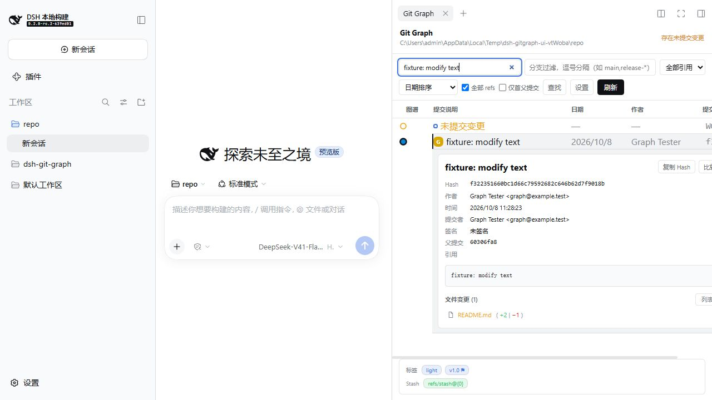
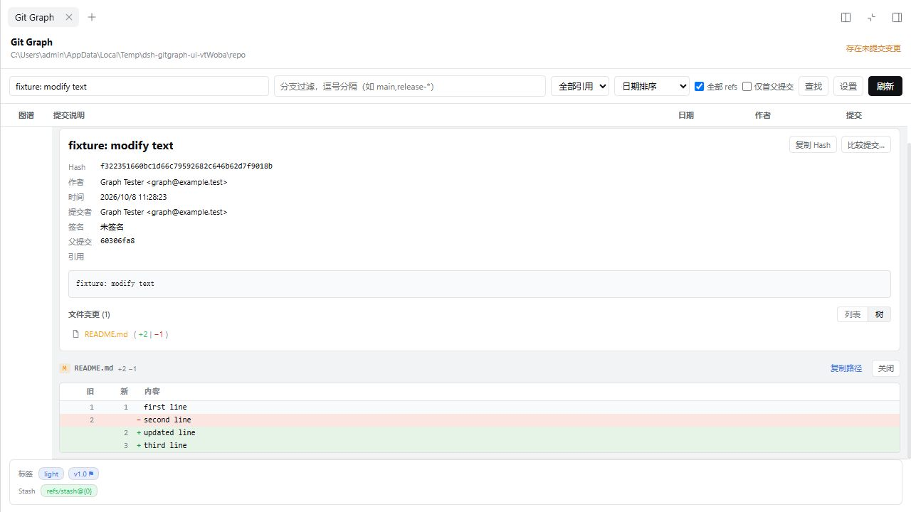
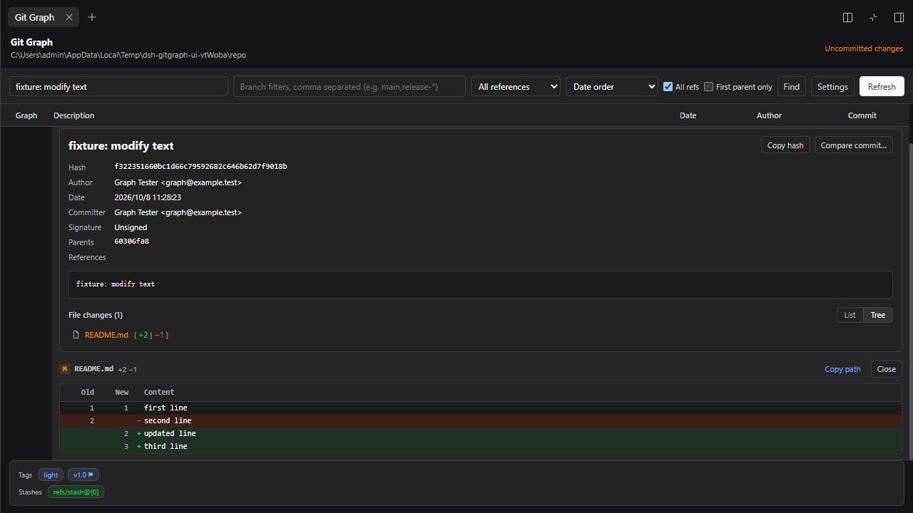

# `dsh-git-graph`

为 DeepSeek Harness Web 的原生右侧栏提供只读 Git Graph。插件 **0.1.0** 适配 **DSH 0.2.0-rc.2**，这是 2026-10-08 核实的官方默认发布版本；DSH 尚未发布不含预发布后缀的正式稳定版。

从右侧栏开始页打开图谱，即使是空会话也能查看当前工作区，不需要配置 API Key 或发送对话消息。



## 功能

- 在原生右侧栏提供 `Git Graph` 页签、开始页入口和面板全屏。
- 显示提交拓扑、分支、合并和父提交关系。
- 显示本地分支、远程分支、tag 和 HEAD 引用标签。
- 在图谱头部显示工作区干净或存在未提交变更的状态。
- 跨初始页面搜索 Hash、主题、作者、邮箱、引用名和日期。搜索最多扫描所选历史的 2000 条提交；图谱初始显示 100 条，最多显示 500 条结果。
- 按本地分支名 glob 过滤（如 `main,release-*`，OR 组合），按引用类型筛选，并选择是否包含全部 refs。
- 支持日期、作者日期、拓扑三种提交排序，以及仅首父提交模式。
- 选中提交后在**该提交行下方内联展开**详情：Hash、作者、提交者、时间、父提交、签名状态和引用标签，布局对齐 vscode-git-graph。
- 文件变更支持树 / 列表两种视图、文件夹图标与单链目录压缩、按变更类型着色。文本修改和重命名条目显示 `(+增|−删)` 统计；新增、删除和二进制文件列表行不显示该统计。
- 点击文件查看带新旧行号的逐行 Diff，支持删除文件、重命名、根提交及相对首父的合并提交；明确区分二进制变更。
- 展开 `未提交变更` 行查看工作区文件列表和逐文件 Diff，包括首提交前已暂存的文件。
- 从当前查询已加载的提交中选择两个，比较文件变更。
- 在元数据条中查看仓库的 Tag 和 Stash 列表。
- 结果内查找栏：大小写敏感、正则、上一个 / 下一个跳转。
- 显示设置面板：日期 / 作者 / Hash 列开关、日期格式、图样式，按仓库持久化。
- 图谱内部获得焦点时，`Ctrl/Cmd+F` 打开查找、`Ctrl/Cmd+Shift+F` 切换设置，输入框内也生效。关闭查找并清空查找文本后，`↑` / `↓` 选择当前可见提交，`H` 选择仍可见的 HEAD；输入框内不拦截这些普通按键。
- 中英文实时切换、DSH 明暗主题、窄屏滚动。
- 刷新当前仓库，且不会生成对话消息或工具轨迹记录。
- 按需加载更多提交，最多读取 500 条。
- 当前目录不是 Git 仓库或仓库尚无提交时显示空状态，不显示错误。

当前版本是只读版本，不会创建、删除、重命名、合并、变基、推送、拉取、Fetch、创建 tag、Stash 或重置 Git 数据。



## 打开 Git Graph

将插件安装到 DSH Web 使用的 profile，重启该 profile。选择工作区，打开原生右侧栏，在侧栏开始页选择 `Git Graph`；需要更大空间时使用面板的原生全屏按钮。

页面读取当前会话的工作区。刷新操作直接调用插件的 Typert Remote，不会把刷新结果渲染为对话工具卡片，也不会向轨迹追加刷新事件。

## Git 数据与路径处理

Host 侧通过固定且不经过 shell 的 subprocess 参数读取 Git 数据。界面按需加载仓库状态、HEAD、有数量限制的提交历史、提交详情、文件 Diff、工作区变更和提交比较结果。另有独立 `readFile` Remote API，但界面的文件查看器使用 Diff API。

浏览器查询绑定当前会话工作区，拒绝任意仓库 `path`。独立的模型工具保留以下参数：

```text
git_graph({
  path?: string,          // 仓库目录，默认使用当前会话工作区
  max_commits?: number,   // 1..500，默认 100
  all?: boolean,          // 是否包含所有可达 refs，默认 true
  first_parent?: boolean, // 是否只跟随首父提交，默认 false
  glob?: string[],        // 本地分支名 glob 过滤（OR），提供时覆盖 --all
  search?: string,        // Hash、主题、作者、邮箱、引用名、日期；扫描上限 2000
  sort?: string           // 提交排序：date、author-date 或 topological，默认 date
})
```

模型工具传入的路径只作为 Git subprocess 工作目录，不拼接进 shell 命令。文件请求必须使用仓库相对路径，绝对路径与指向仓库外的路径会被拒绝。侧栏使用当前会话工作区，分别显示非 Git 目录和无提交仓库的空状态；无提交仓库仍可查看已暂存文件。

## 安装或更新

前提：已安装 **DSH 0.2.0-rc.2** 且可使用 `dsh` CLI，DSH Host 上可以执行 Git。直接从版本标签安装到 Web profile：

```powershell
dsh plugin --profile web add https://github.com/WhitePlusMS/dsh-git-graph/archive/refs/tags/v0.1.0.tar.gz
dsh web
```

归档包含已提交的 `lib/` 产物，使用者无需克隆或构建项目。首次 `add` 时，如果名为 `web` 的 profile 不存在，CLI 会按 Web 模板自动创建。更新已运行的 Web profile 前先停止它，执行 `add` 后重新启动；运行中的进程保留启动时加载的包代码。后续版本更新时，将 URL 中的标签替换为目标版本。

全新的自定义 Web profile 可先执行 `dsh --profile my-web --from-default-profile web --dump-config`，再用 `dsh plugin --profile my-web add <归档URL>` 安装，通过 `dsh --profile my-web` 启动。

也可以在本项目目录生成本地安装包：

```powershell
pnpm install --frozen-lockfile
pnpm run typecheck
pnpm pack --pack-destination .scratch/release
dsh plugin --profile web add ./.scratch/release/dsh-git-graph-0.1.0.tgz
```

已有 `.tgz` 时直接将包路径传给 `dsh plugin --profile web add`。安装后重启 `dsh web`，使 Host 和浏览器端加载新包；使用自定义 profile 时替换命令中的 `web`。

新实现不保留旧 DSH API 兼容。


## 卸载

从 `web` profile 卸载当前包：

```powershell
dsh plugin --profile web remove dsh-git-graph
```

移除后重启该 profile，让运行中的应用卸载插件。CLI 会同时移除包依赖和 bundle 列表项；卸载时使用安装时相同的 profile 名称。

## 开发

```powershell
pnpm install --frozen-lockfile
pnpm run typecheck
pnpm run build
```

构建将独立 Host 和浏览器端产物写入 `lib/`，安装包不要求检出 Harness monorepo。根 TypeScript solution 分别引用 Host、Client 和测试程序；客户端使用 Cordis effect、类型化本地化、原生侧栏服务和目标 DSH 版本的主题别名。

仓库目前不追踪 `tests/`，新克隆中没有测试文件。仅在保留本地测试集的工作区执行 `pnpm test`；下述测试数量是本次本地升级验收结果，并不表示仓库附带该测试集。

本次在官方发布源码构建的 DSH 上通过 **78 项自动测试和 48 项真实浏览器操作**。版本依据、复现步骤和覆盖范围见[升级与测试报告](docs/DSH_0.2_TEST_REPORT.md)。




## 参考与灵感来源

本项目的诞生与参考完全基于以下开源项目：[vscode-git-graph](https://github.com/mhutchie/vscode-git-graph)，再次对其表示感谢。

## 许可证

MIT
