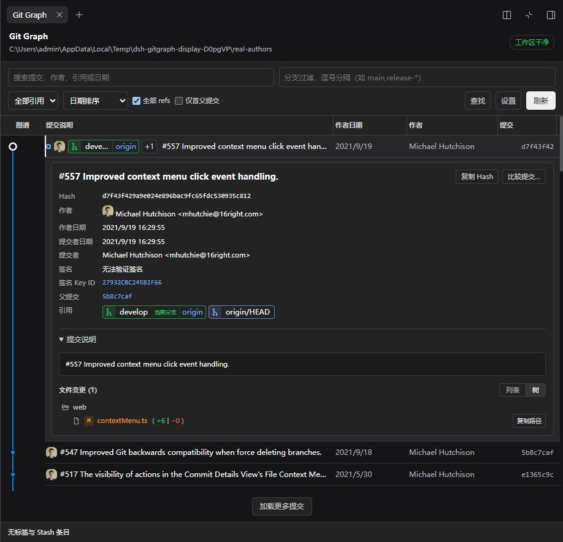
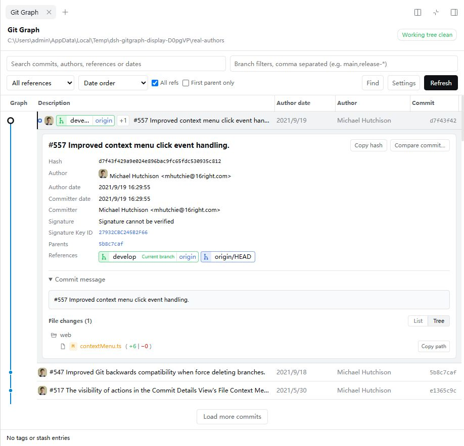
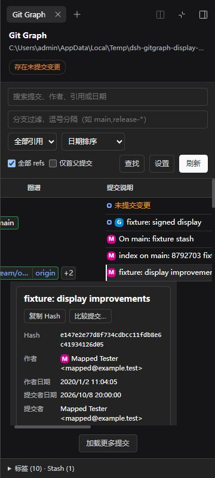

<p align="center">
  
</p>

<p align="center">
  <strong>当前版本 0.4.0</strong> · 适配 DSH 0.2.0-rc.2 · <a href="LICENSE">MIT</a><br>
  <a href="README.md">English</a> · <a href="docs/screenshots/readme-header.svg">静态标题</a>
</p>

为 DeepSeek Harness Web 的原生右侧栏提供只读 Git Graph。直接浏览工作区的提交历史、分支和文件变更，无需 API Key 或发送对话消息。

<p align="center">
  <a href="#安装与更新">安装</a> · <a href="#使用">使用</a> · <a href="#快捷键">快捷键</a> · <a href="#使用范围">使用范围</a> · <a href="#卸载">卸载</a> · <a href="#更多文档">更多文档</a>
</p>



<details>
<summary>更多截图：英文浅色主题与 360px 窄侧栏</summary>





</details>

## 功能

- **提交历史**：提交拓扑、分支、Tag、HEAD，以及提交搜索和历史筛选。
- **提交详情**：行内展示作者与提交者日期、父提交、引用、签名状态和复制操作。
- **引用布局**：三种引用布局，同一提交上的同名本地 / 远端分支可合并显示。
- **文件变更**：文件树 / 列表、逐文件 Diff、未提交变更，以及两次提交的变更文件清单比较。
- **正文与头像**：正文链接、粗体、斜体、行内代码，以及 GitHub / Gravatar 真实作者头像。
- **显示设置**：可调列宽、日期显示、紧凑行高、连线样式和配色，按仓库保存设置。
- **界面适配**：中英文、明暗主题、面板全屏和窄屏显示。

## 安装与更新

需要 **DSH 0.2.0-rc.2**、可用的 `dsh` CLI，以及 DSH Host 上已安装的 Git。

使用 `v0.4.0` 标签归档安装：

```powershell
dsh plugin --profile web add https://github.com/WhitePlusMS/dsh-git-graph/archive/refs/tags/v0.4.0.tar.gz
dsh web
```

更新时先停止 DSH Web，执行目标版本的 `add` 命令，再重新启动。

自定义 profile、本地 `.tgz` 安装和源码构建见[开发指南](docs/DEVELOPMENT.md#本地安装与自定义-profile)。

## 使用

1. 在 DSH Web 中选择工作区，打开右侧栏。
2. 从侧栏开始页选择 **Git Graph**。
3. 点击提交查看行内详情，点击文件查看 Diff；点击 **未提交变更** 查看工作区改动。

通过 **设置** 调整显示效果，设置按仓库分别保存。

真实头像默认开启，会访问 GitHub / Gravatar。GitHub 查询使用提交作者邮箱，Gravatar 使用邮箱摘要。可以在设置中关闭；无图片或请求失败时显示首字母头像。

## 卸载

```powershell
dsh plugin --profile web remove dsh-git-graph
```

卸载命令使用安装时的 profile 名称，移除后重启该 profile。

## 快捷键

| 操作 | 效果 |
| --- | --- |
| `Ctrl/Cmd+F` | 在已加载结果中查找 |
| `Ctrl/Cmd+Shift+F` | 切换显示设置 |
| `↑` / `↓` | 关闭并清空查找后，选择提交 |
| `H` | 定位 HEAD，超出范围则提示 |
| 行或节点上的 `Enter` / `Space` | 选择提交 |
| 拖拽列分隔线 / `←` / `→` | 调整列宽；方向键需先聚焦分隔线 |
| 双击分隔线 | 恢复默认列宽 |

快捷键在 Git Graph 获得焦点时生效，普通导航键不会拦截输入框中的文字输入。

## 使用范围

- 图谱读取当前工作区的本地 Git 数据；刷新不会执行 Fetch，也不会修改仓库。
- 初始加载 100 条提交，手动加载最多 500 条；搜索最多扫描 2000 条，查找仅针对已加载结果。引用类型筛选只显示直接带对应标签的提交。
- 两提交比较仅显示文件清单，尚无左右 Diff、完整版本原文、Tag 签名验证或 Stash Diff；Tag / Stash 条目提供摘要和复制。

## 更多文档

- [开发、本地安装与 API 说明](docs/DEVELOPMENT.md)
- [显示功能验收报告](docs/DISPLAY_TEST_REPORT.md)
- [P0 报告](docs/P0_TEST_REPORT.md) · [DSH 适配报告](docs/DSH_0.2_TEST_REPORT.md)

---

参考项目：[vscode-git-graph](https://github.com/mhutchie/vscode-git-graph)，感谢其作者和贡献者。

许可证：[MIT](LICENSE)。
