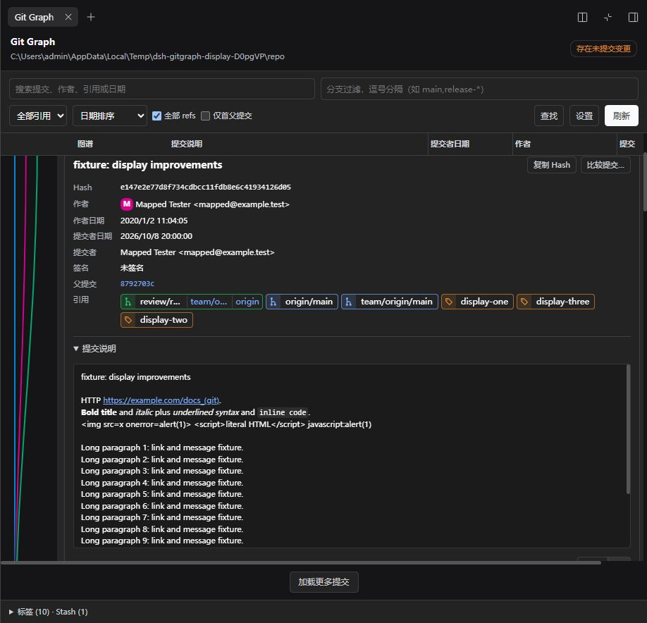

# 显示功能与真实作者头像验收

- 日期：2026-10-09。
- 运行环境：Windows、Node.js 22.22.1、官方 DSH CLI 0.2.0-rc.2，独立 `.scratch/dsh-display-home` 的 `web` profile。
- 范围：0.4.0 所含的显示更新。验收时临时包为 0.3.0，随后包版本调整为 0.4.0；版本调整另行通过类型检查、构建和打包。原有 `v0.3.0` 标签仍指向 `7feac213b502bba77c8790630c587558faa017ad`，未包含本报告的新功能。验收不代表 0.4.0 标签已发布。
- 最终布局只提供行内详情。此前试验的底部停靠已按用户要求删除，不计入本报告。

## 实际实现

| 功能 | 最终行为 |
| --- | --- |
| 详情 | 提交、文件 Diff、提交比较与未提交变更都在对应行下展开；移除位置选择和高度设置 |
| 引用 | 三种布局；按真实远端名称匹配，同提交的同名 local/remote 分支合并，原始名字分别复制 |
| 正文 | HTTP(S)、粗体、斜体、行内代码；可关闭；HTML 为字面文本 |
| 日期 / 身份 | 日期栏切换作者 / 提交者日期，详情同时显示；采用 Git mailmap |
| 签名 | Git 提交签名状态的文字解释、签名者及可复制 Key；没有增加 Tag 验签 |
| 头像 | 默认开启，自动 GitHub / Gravatar 或仅 Gravatar；无图及失败保留首字母；按仓库保存设置 |

头像 Host 只接受当前会话的提交 Hash 和来源，不接受浏览器提供的任意邮箱或 URL。原始作者邮箱用于 GitHub 公开提交查询，映射邮箱用于 Gravatar SHA-256 摘要。限定 HTTPS 服务域名、栅格图片、64 KiB 图片上限、每次请求 4 秒、4 并发、24 个提交一批。进程内最多 128 条缓存，成功 24 小时、失败 15 分钟；重启清空，不写头像文件。

依据：[GitHub commits API](https://docs.github.com/en/rest/commits/commits)、[Gravatar 邮箱摘要](https://docs.gravatar.com/rest/hash/)、[Gravatar 图片参数](https://docs.gravatar.com/sdk/images/)。

## 代码和自动检查

- `src/domain.ts`、`src/git.ts`、`src/runtime.ts`：必需提交者日期、真实 remote 名称、mailmap，以及只读头像身份查询。
- `src/avatars.ts`、`src/remote-service.ts`、`src/typert.*`：取图、缓存、取消、严格请求 / 结果 DTO；前后端同一合同，不兼容旧日志格式。
- `src/client/avatars.ts`、`RichMessage.tsx`、`GitGraphView.tsx`、`presentation.ts`、`settings.ts`、`styles.ts`、`locales.ts`、`index.ts`：显示、设置、生命周期和本地化。
- 对应 `lib/` 产物已构建，安装到隔离 profile 的客户端 / Git / 头像产物与根目录文件 Hash 一致。
- Host、Client、Tests 三个 TypeScript 程序的严格类型检查通过；没有新增依赖。
- 完整 11 个测试文件 **106 项通过**。覆盖原有 Git / 图谱功能以及头像请求 / 结果、成功和失败缓存、到期、去重、并发、取消、限流、域名 / 重定向 / 图片大小、真实 Git mailmap 和日期、索引不变、引用合并及正文安全。
- 本地原始结果：`.scratch/display-tests-final.txt`、`.scratch/display-qa-results.json`。`tests/` 延续现有忽略规则，未改变仓库测试文件的追踪策略。

## 真实 DSH 点击检查

使用独立临时仓库：复杂分支历史、带斜杠的远端名称、多引用、长正文、不同日期、mailmap、工作区变更和 Windows OpenSSH 创建的真实 SSH 签名。照片测试使用本地参考仓库的只读克隆，保留其公开作者身份。

| 编号 | 已验证项目 | 结果 |
| --- | --- | --- |
| 1 | 设置没有详情位置或高度 | 通过 |
| 2 | HTTP 链接、粗斜体、行内代码 | 通过 |
| 3 | HTML / javascript 保留文本，链接安全属性正确 | 通过 |
| 4 | mailmap、作者日期与提交者日期匹配独立 Git 结果 | 通过 |
| 5 | 日期栏切换提交者日期 | 通过 |
| 6 | 关闭正文格式显示原始文本 | 通过 |
| 7 | Tag 靠右、组合分支保留完整复制入口 | 通过 |
| 8 | 关闭引用合并后分别显示 | 通过 |
| 9 | 长正文展开后的行 / SVG 节点对齐 | 通过 |
| 10 | 实际复制签名 Key，剪贴板与 Git 相同 | 通过 |
| 11 | 行内提交文件 Diff 读取 / 关闭 | 通过 |
| 12 | 两提交比较仍在行内显示 | 通过 |
| 13 | 未提交变更只有一份行内详情 | 通过 |
| 14 | 工作区 Diff 内容及刷新保留 | 通过 |
| 15 | 紧凑 28px 行高和 SVG 对齐 | 通过 |
| 16 | 360px 靠图引用与详情不撑宽页面 | 通过 |
| 17 | 真实照片在 DSH 中解码为 64px 图片 | 通过 |
| 18 | 列表与详情显示同一作者照片 | 通过 |
| 19 | 关闭真实头像恢复首字母 | 通过 |
| 20 | 重新开启复用照片缓存 | 通过 |
| 21 | Gravatar 来源切换 | 通过 |
| 22 | 刷新保留头像和所选行 | 通过 |
| 23 | 重新加载保存头像来源设置 | 通过 |
| 24 | English / 浅色主题及新增设置 | 通过 |
| 25 | 只有行内详情，没有底部容器 | 通过 |
| 26 | 真实 SSH 签名 G 状态、解释和 Key 匹配 Git | 通过 |

共 **26 项通过**，与历史 P0 的 56 项分开统计。剪贴板验收使用可见原生按钮；后台 DOM 点击没有获得剪贴板焦点时，不将其误报为复制成功或产品失败。

## 截图

真实照片与唯一行内详情：

正文格式与两种日期：

360px 靠图引用布局：

浅色英文界面：

## 核对结果与边界

- 本次真实取图成功来源为 **Gravatar**。GitHub 匿名 API 在取图验证中返回 403 / 剩余额度 0，自动回退成功；GitHub 成功路径通过自动测试，没有宣称本次真实联网成功。
- 原参考 `vscode-git-graph` 的 HEAD、refs、状态、索引和文件 Hash 与测试前一致。两份 DSH 会话缓存仍为 blank，turns / steps / LLM / tool 时间和 token 用量均为 0。证据为 `.scratch/display-final-audit.json`。
- 临时夹具在最终核对前已经不存在，因此无法补做夹具结束时的完整 Hash 比较；不声称该项通过。只读 Git 指令和索引不变另有自动测试覆盖。
- 本次空间不足中断过一次测试日志写入，随后使用其他临时位置完成 106 项测试；现有结果和截图已保存回项目，未移动 DSH 参考源码。未以磁盘错误推断产品缓存问题。
- 本轮隔离 DSH 服务已停止，最终确认 3091 没有监听。未操作其他应用服务。
- 不包含历史淡化、Issue / Emoji 配置、右键菜单、GitLab 专属头像、完整版本原文 / 左右 Diff 或 Git 写操作。原有 P0 报告保留其当时的范围。
