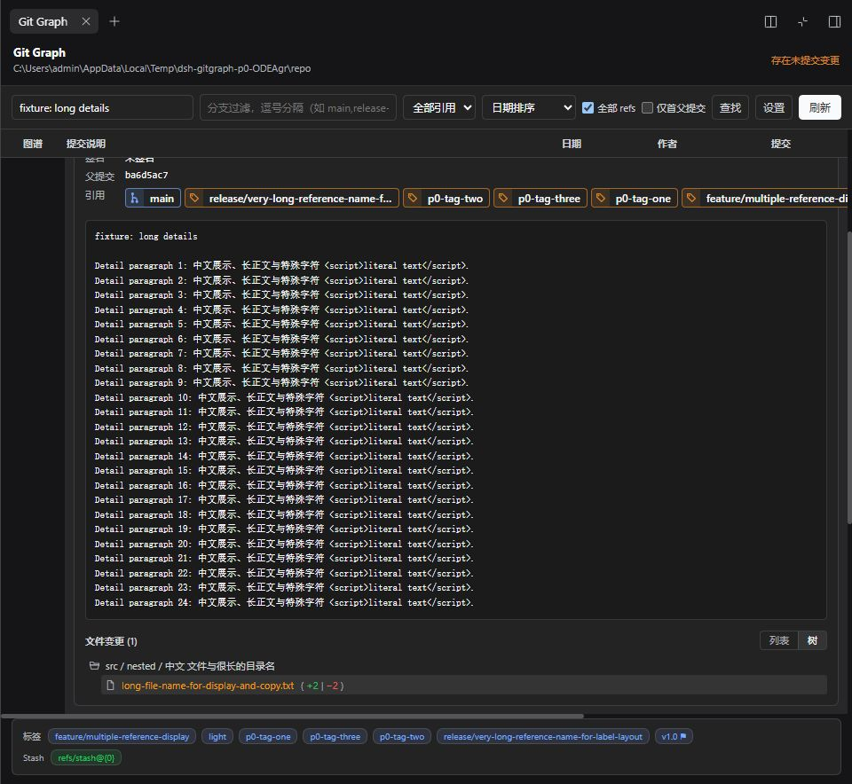
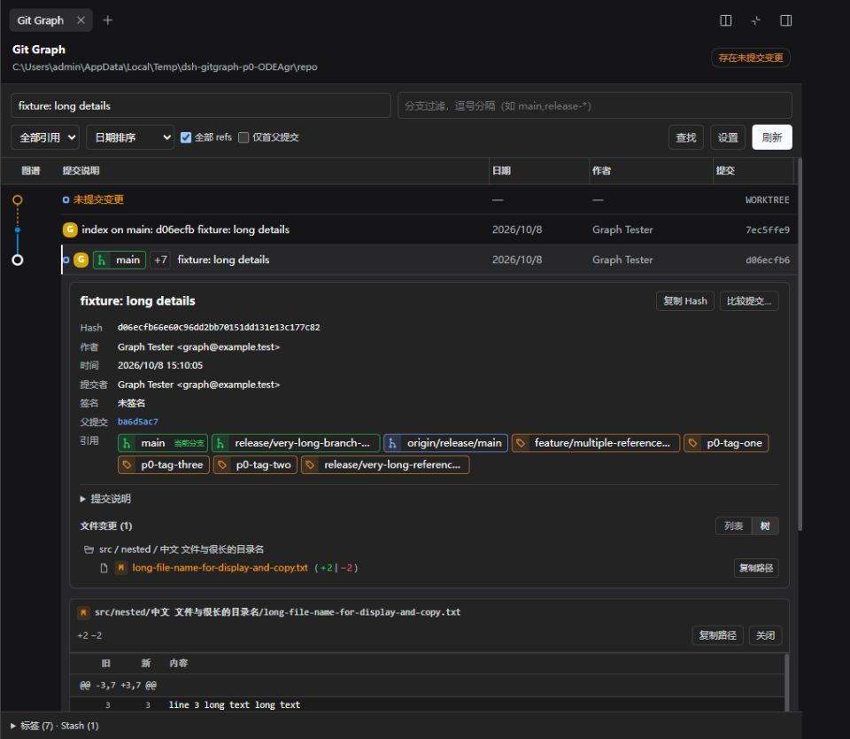
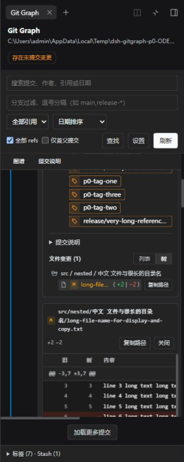
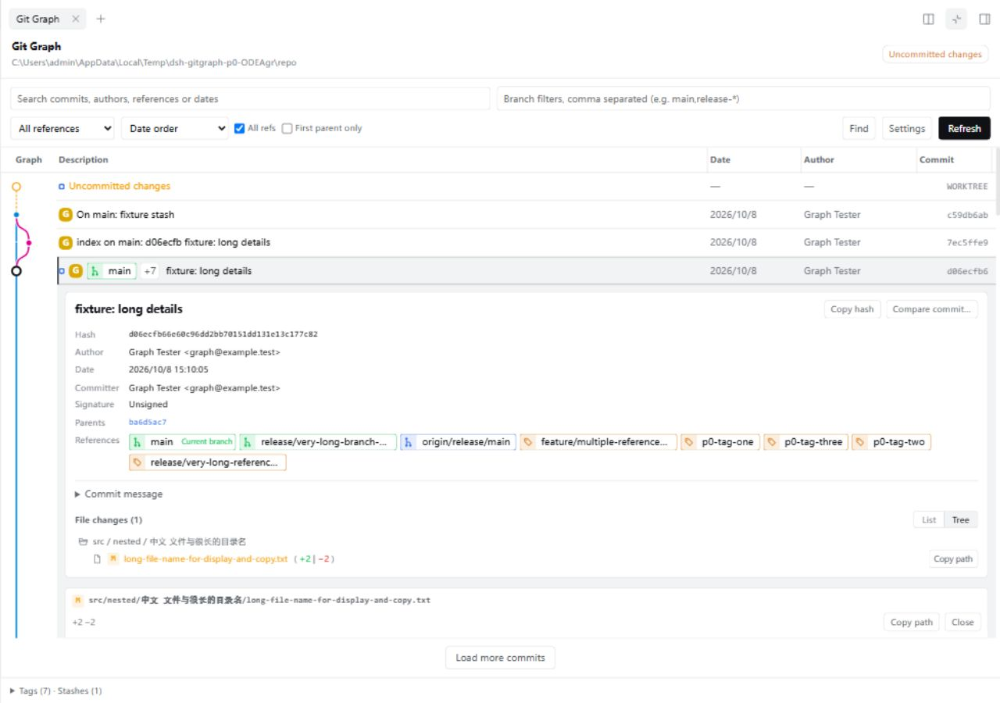

# P0 显示优化与验收报告

日期：2026-10-08。范围为 DEVELOPMENT_PLAN.md 中 P0-00 至 P0-07，全部完成；P1–P4 尚未实施。

本报告记录 v0.3.0 所含 P0 实现的本地验收。验收时测试包使用 0.1.0 版本号，旧 GitHub v0.1.0 标签保持不变；当前包版本为 0.3.0。验收数据不代表已经推送标签或完成线上发布。

## 实际改进

| 任务 | 完成内容 | 验证依据 |
| --- | --- | --- |
| P0-00 显示可信 | Tag 未验签不再标 G；完整 refs namespace 分类；HEAD 与本地分支区分；未统计行数不误标 binary；失败与空态分开 | 签名解析、真实嵌套分支/远端与 detached HEAD 自动回归；真实 empty/not-git、binary、缺文件/重试点击 |
| P0-01 布局与主题 | 分组工具栏、统一字号/间距/按钮、路径省略、收起元数据；详情按当前容器宽度显示 | 360/600/1280 宽度、侧栏/全屏、中英文及明暗主题 |
| P0-02 列宽与密度 | 拖拽/方向键列宽、边界、双击重置、恢复默认；自动填充直到手动调整；28/36px 行高与 SVG 一致 | 实际拖拽 50px、方向键 10px、几何测量、存储与仓库隔离 |
| P0-03 图谱 | 根节点不连接无关历史；范围外父提交虚线；曲/直线与两种配色；节点/行悬停联动 | 布局回归含线性、分叉、合并、三父提交、连续合并、缺失父节点；实际 SVG 对齐及悬停 |
| P0-04 引用标签 | 当前分支优先，按本地/远端/Tag 排序着色；行内主引用与更多入口；详情完整名单；复制与完整 tooltip | 八引用展开、长分支/Tag、准确分类、完整名称复制 |
| P0-05 详情与文件 | 长正文折叠、元数据层次、文件状态、rename 两侧路径、树/列表、所有已有文本统计与复制反馈 | 正文中的 HTML 作为字面文本；root/merge/A/M/D/R/binary、中文空格长路径及树/列表切换 |
| P0-06 Diff | 真实行号分段范围标题、等宽字体、长行横向滚动、限制 Diff 高度、独立文件头操作、加载/错误/重试 | 两段 hunk、内容中的 +++/---、root 空树、merge 首父、纯 rename 无行变化、删除、binary、文件消失/恢复 |
| P0-07 导航与刷新 | Find/上下/H 新选择自动定位；限定键盘作用域；无效正则/范围外 HEAD 提示；保留已展开工作区并刷新其文件和元数据 | 页面底部 Find、H、输入框保护、仓库切换、工作区新内容与恢复内容刷新 |

文件列表的 null 统计统一显示“无文本统计”：未跟踪文件可能尚未统计，不能据此认定为二进制。打开文件 Diff 后，只有真实 binary 字段才显示二进制提示。

## 代码与产物

- src/client/GitGraphView.tsx：复用已有详情、文件树/列表和 Diff，统一 CopyButton，接入列宽、提示、焦点、自动定位及可变数据刷新。
- src/client/styles.ts、locales.ts：容器响应式布局、共享几何、主题别名及完整中英文文案。
- src/client/settings.ts：严格读取有界列宽、密度、图线、配色和 fitDescription，按仓库保存。
- src/client/presentation.ts：共享行高/图宽/可见列及 Diff 分段范围，不引入通用 UI 框架。
- src/client/graph-layout.ts：修正 root 终点并标记范围外父提交，沿用已有布局策略。
- src/git.ts：修正 refs/HEAD 和 Tag 未验证状态；所有查询使用固定参数、字面路径及 no-optional-locks，避免可选索引刷新。[Git 官方参数文档](https://git-scm.com/docs/git)。
- lib/client.js、lib/git.js：已重新构建；测试安装后逐次核对其 SHA-256 与当前构建一致。
- tests/ 中相应本地回归更新；该目录继续遵循既有忽略规则，新克隆不自带测试集。没有新增 Git 写 API 或旧 DSH 兼容分支。

## 环境与验证范围

- Windows，实际默认全局 dsh CLI 0.2.0-rc.2；本次使用官方发行版运行，未要求再次构建 DSH 源码。
- 独立 DSH_HOME 为 .scratch/dsh-p0-home，profile 为 web。没有在用户原 .dsh 中安装/卸载插件。
- .scratch/create-p0-fixtures.mjs 创建独立 repo、无首提交且有暂存文件的 empty、not-git。主仓库 116 个可达提交，包含分叉、merge、Tag、远端跟踪引用、Stash、rename、delete、binary、长正文、中文空格路径和 450 行分段 Diff。
- GitHub 已发布的旧 v0.1.0 本地包用于截图基线；当前工作区新包用于验收。相同主仓库、相同搜索/目标及 960×884 视口保存前后截图。
- 首次默认工作区是 Documents 目录；按官方 workspace version 2 格式，仅在停止的隔离 home 登记夹具目录，随后通过真实 UI 选择工作区。没有将任意仓库 path 加回浏览器 RPC。
- 56 项浏览器检查是本轮分批实施及最终回归的累计结果，使用真实界面点击、复制、拖拽、输入及 DOM 几何；自动回归覆盖额外拓扑/Host 边界。未把全部可能组合都描述为已实际点击。

## 测试结果

- Host/Client/tests 严格 TypeScript 检查通过。
- 完整本地自动测试：10 个文件、88 项通过。包含真实 Git 输出、detached HEAD、嵌套本地/远端引用、索引字节不变、签名误判、列宽边界、Diff 分段和复杂合并拓扑。
- 实际浏览器：56/56 通过；最终正常页面 error 日志 0。
- 构建、打包和安装产物核对通过。
- 主 fixture 的 HEAD、全部 refs（含 Stash）、index SHA-256、工作区状态及全部 6 个现存文件内容在验收前后一致。
- 四个测试 session 的完整 zstd 拼接帧记录共 18 条；消息、模型请求、模型工具调用为 0。
- 测试服务和辅助服务已停止，3091/3092 均无监听；临时浏览器尺寸恢复。没有保留环境或 HTTP 策略钩子。

复制失败采用**独立测试包的定向故障注入**：仅将共享 writeText 调用替换为 NotAllowedError，实际点击验证失败文案；恢复正常包后验证复制成功。此结果不声称验证了系统原生权限弹窗。正常源码、lib 与交付包没有故障注入代码。未成功的 iframe/响应策略尝试不计入通过项。

文件错误采用真实夹具文件移动/恢复，并核对恢复后的字节；工作区刷新采用临时追加标记再恢复原内容。所有故障只施加在本次夹具中。

## 浏览器检查清单

| 序号 | 场景 | 结果 |
| --- | --- | --- |
| 1 | 全局发行DSH启动和完整Graph读取 | 通过 |
| 2 | 详情展开后SVG与36px行高对齐 | 通过 |
| 3 | 实际HEAD唯一 | 通过 |
| 4 | 嵌套本地分支分类 | 通过 |
| 5 | 长正文默认折叠 | 通过 |
| 6 | 两段真实Diff范围标题 | 通过 |
| 7 | 长行Diff可横向滚动 | 通过 |
| 8 | 完整Hash复制与反馈 | 通过 |
| 9 | 完整分支名复制 | 通过 |
| 10 | 中文空格长路径复制 | 通过 |
| 11 | 键盘调整列宽 | 通过 |
| 12 | 紧凑28px行高与SVG同步 | 通过 |
| 13 | 直线和易辨识配色可切换 | 通过 |
| 14 | 作者列显隐同步 | 通过 |
| 15 | 新包重载后列宽/密度/显隐持久化 | 通过；首轮读取完成后验证 compact、122px 日期列和隐藏作者列 |
| 16 | 说明列实际宽度响应键盘 | 通过 |
| 17 | 鼠标拖拽说明列实际改变50px | 通过 |
| 18 | 恢复默认列宽与36px密度 | 通过 |
| 19 | Find定位到已加载页面底部 | 通过 |
| 20 | H选择并滚动到HEAD | 通过 |
| 21 | 上下键选择与展开互斥 | 通过 |
| 22 | 刷新保留选中和滚动上下文 | 通过 |
| 23 | 360px详情操作留在视口 | 通过 |
| 24 | 最终包360px按钮可操作和无工具栏溢出 | 通过 |
| 25 | 600px侧栏详情和按钮适配 | 通过 |
| 26 | 更多引用打开全部八个引用 | 通过 |
| 27 | 长正文展开保留HTML字面文本 | 通过 |
| 28 | 树列表切换保留已开文件 | 通过 |
| 29 | 英文实时词典与浅色主题 | 通过 |
| 30 | 英文360px工具栏无溢出 | 通过 |
| 31 | 复制NotAllowedError故障注入显示失败且可重试 | 通过；独立测试包共享writeText拒绝，实际点击验证，正常产物未修改 |
| 32 | 恢复正常包后复制成功 | 通过 |
| 33 | 工作区未跟踪文本逐文件Diff | 通过 |
| 34 | 文件消失返回明确错误并提供重试 | 通过 |
| 35 | 恢复文件后重试成功且读取新内容 | 通过 |
| 36 | 未跟踪文本未知统计不会误标二进制 | 通过 |
| 37 | 最终版本刷新保留工作区文件并读取新内容 | 通过 |
| 38 | 恢复原内容后刷新移除测试标记 | 通过 |
| 39 | 历史搜索保留根提交与真实分叉 | 通过 |
| 40 | 根提交新增统计与空树Diff | 通过 |
| 41 | 合并提交相对首父的新增文件 | 通过 |
| 42 | 重命名前后路径清晰且保持R状态 | 通过；等待读取完成；纯rename准确显示无行级变化 |
| 43 | 删除统计及删除前文本Diff | 通过 |
| 44 | 二进制变更与空Diff明确区分 | 通过 |
| 45 | 引用类型过滤范围明确说明 | 通过 |
| 46 | 被筛选父提交用虚线而非虚构连线 | 通过 |
| 47 | HEAD超出当前范围时明确提示 | 通过；提示含关闭按钮，按提示容器验证实际文本 |
| 48 | 无效正则显示明确错误 | 通过 |
| 49 | 输入框内H不被导航截获 | 通过 |
| 50 | 空仓库状态与非Git目录区分 | 通过 |
| 51 | 不同仓库不串用compact显示设置 | 通过 |
| 52 | 无首提交已暂存文本可查看Diff | 通过 |
| 53 | 非Git目录为正常空态无失败alert | 通过 |
| 54 | 回到原仓库恢复其compact设置 | 通过 |
| 55 | 最终正常页面浏览器错误为0 | 通过 |
| 56 | 鼠标节点与提交行悬停同步 | 通过 |

## 截图

相同仓库与视口的改动前基线：



相同仓库与视口的改动后：



360px 下可操作的详情与文件 Diff：



英文浅色界面：



## 复现与本地安装

在保留测试集的本地工作区：

```powershell
pnpm run typecheck
pnpm test
pnpm pack --pack-destination .scratch/p0-release
dsh plugin --profile web add ./.scratch/p0-release/dsh-git-graph-0.3.0.tgz
dsh web
```

更改前停止目标 profile，安装后重启。GitHub v0.1.0 安装命令仍对应旧实现；v0.3.0 归档需该标签推送至 GitHub 后才能安装。

本地详细证据为 .scratch/p0-qa-results.json、p0-state-verification.json、p0-tests-final.txt 与隔离 session 记录。这些沿用忽略规则，公开复现时需自行创建夹具或使用实际仓库。

## 保留到下一阶段的边界

- 类型过滤仍限已加载且直接带标签的提交，完整分支历史多选属于 P1。
- 两提交比较仍是文件清单，尚未提供逐文件比较 Diff、任意提交与工作区比较或完整版本原文。
- Tag/Stash 本次只有摘要/复制，不等同于完整详情、图谱导航、写操作或真实 Tag 验签。
- 仅在当前结果内定位；超过现有加载范围的自动定位、累计超过 500 条的分页、自动文件监控、头像与左右 Diff 后排。
- 含 TAB 的 Git 路径在解析/数据测试中覆盖，Windows 实际文件夹具使用中文与空格；没有将它写成 Windows 文件名的实际点击场景。
